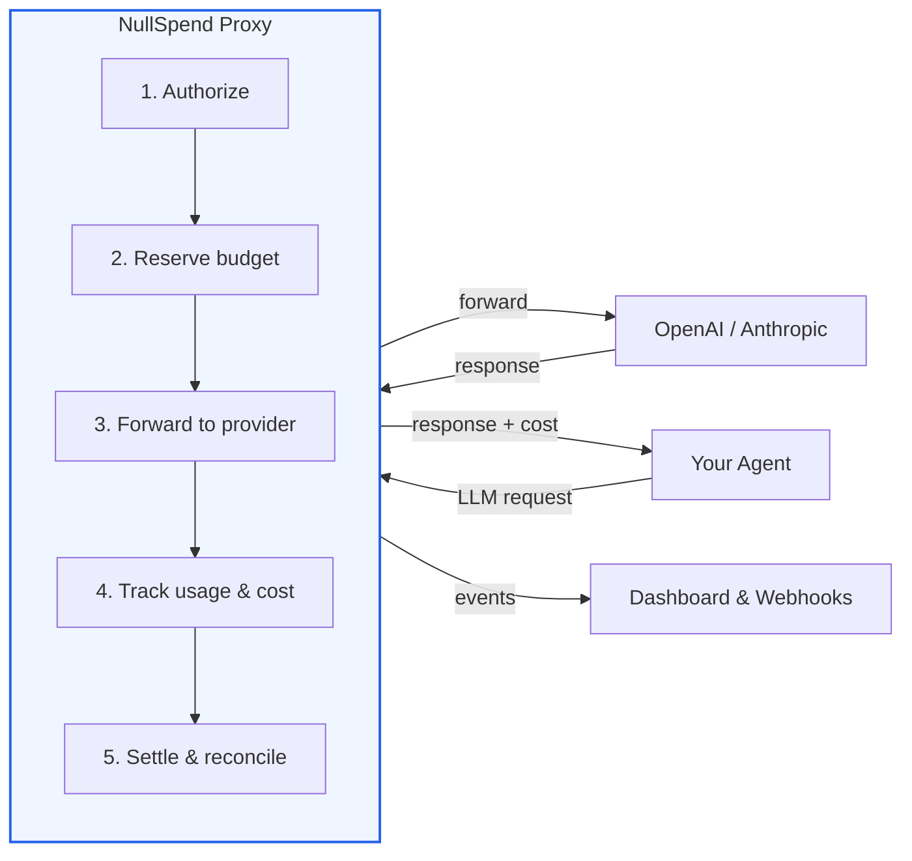
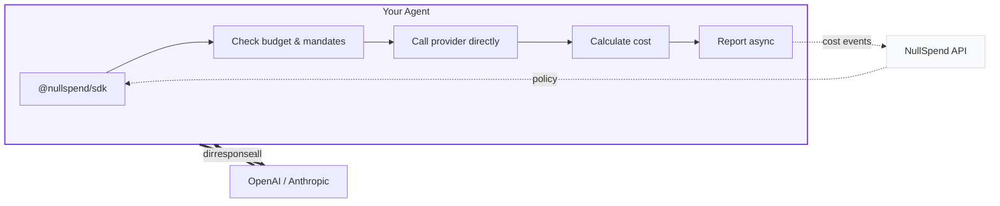

<p align="center">
  <h1 align="center">NullSpend</h1>
  <p align="center">
    <strong>Financial infrastructure for the autonomous AI economy.</strong>
    <br />
    The first FinOps platform purpose-built for AI agents.
  </p>
</p>

<p align="center">
  <a href="https://github.com/NullSpend/nullspend/actions"></a>
  <a href="https://github.com/NullSpend/nullspend/blob/main/LICENSE"></a>
  <a href="https://nullspend.dev/docs"></a>
</p>

---

AI agents are becoming autonomous economic actors. They negotiate, transact, and spend — across providers, tools, and workflows — at machine speed. The infrastructure to govern that spend doesn't exist yet.

**NullSpend is building it.**

We're creating the financial infrastructure layer for the autonomous AI economy: real-time budget authorization, model and provider mandates, spend velocity controls, cost attribution, cross-provider governance, and human-in-the-loop approval — all through a transparent proxy that integrates in one line and enforces in under a millisecond.

```
OPENAI_BASE_URL=https://proxy.nullspend.dev/v1
```

This isn't observability. This isn't logging. This is **financial authorization** — every request checked against your budget before it executes, with the spend reserved atomically and the cost reconciled on completion.

## The Problem Is Structural

Today's AI cost tools are built on a fundamentally broken model: they **observe** spend and **notify** you after the fact. A $50 budget limit enforced on a 60-second polling loop becomes a $764 invoice. A runaway agent loop burns $127K in four hours, and the team finds out on their monthly bill.

Agents don't need dashboards. They need authorization infrastructure.

NullSpend provides:

- **Pre-request budget authorization** — spend is checked and reserved before the LLM call, not reconciled after
- **Model & provider mandates** — restrict which models and providers each API key can access
- **Sub-millisecond enforcement** — real-time synchronous budget checks on every single request
- **Network-level governance** — the proxy is the single control point every request passes through. One env var. Every provider. No escape route.
- **Velocity circuit breakers** — automatically detect and halt runaway spend patterns
- **Tag-level budgets** — enforce spend limits per customer, team, or any dimension you tag
- **Unified LLM + tool budgets** — one budget governs API calls and MCP tool calls together

## Get Started in 2 Minutes

### OpenAI

```typescript
import OpenAI from "openai";

const openai = new OpenAI({
  baseURL: "https://proxy.nullspend.dev/v1",
  defaultHeaders: { "X-NullSpend-Key": process.env.NULLSPEND_API_KEY },
});

// Every call is now authorized, tracked, and enforced. Your code doesn't change.
const response = await openai.chat.completions.create({
  model: "gpt-4o",
  messages: [{ role: "user", content: "Hello" }],
});
```

### Anthropic

```typescript
import Anthropic from "@anthropic-ai/sdk";

const anthropic = new Anthropic({
  baseURL: "https://proxy.nullspend.dev/v1",
  defaultHeaders: { "X-NullSpend-Key": process.env.NULLSPEND_API_KEY },
});
```

### Claude Agent SDK

```typescript
import { withNullSpend } from "@nullspend/claude-agent";

const agent = new Agent({
  client,
  model: "claude-sonnet-4-6",
  ...withNullSpend({
    apiKey: process.env.NULLSPEND_API_KEY,
    tags: { agent: "research-bot", customer: "acme-corp" },
  }),
});
```

### TypeScript SDK

```typescript
import OpenAI from "openai";
import { NullSpend } from "@nullspend/sdk";

const ns = new NullSpend({
  baseUrl: "https://app.nullspend.dev",
  apiKey: process.env.NULLSPEND_API_KEY,
  costReporting: {},
});

const openai = new OpenAI({ fetch: ns.createTrackedFetch("openai") });
```

### Python

```python
from nullspend import NullSpend

ns = NullSpend(api_key="ns_live_sk_...")
```

## Choose Your Integration

Not every use case needs the same level of control. Pick the integration path that fits.

| Capability | Proxy | SDK | Claude Agent | MCP Server | MCP Proxy |
|---|:---:|:---:|:---:|:---:|:---:|
| Cost tracking | Yes | Yes | Yes | Yes | Yes |
| Budget enforcement | Yes | Cooperative | Yes | — | Yes |
| Model & provider mandates | Yes | Cooperative | Yes | — | — |
| Tag-level budgets | Yes | — | Yes | — | — |
| Velocity controls | Yes | — | Yes | — | — |
| Session limits | Yes | Cooperative | Yes | — | — |
| Request/response logging | Yes | — | Yes | — | — |
| HITL approval | Via SDK | Yes | Via SDK | Yes | Yes |
| MCP tool gating | — | — | — | Yes | Yes |
| Budget self-audit | — | Yes | Yes | Yes | — |

**Proxy** gives you full, guaranteed enforcement at the network level — nothing gets past it. **Claude Agent** routes through the proxy automatically, so it inherits every proxy capability. **SDK** gives you cooperative client-side enforcement with direct provider calls. All paths report to the same dashboard.

## How It Works

### Proxy Mode — guaranteed enforcement



Every request follows the same path: **authorize** the spend against your budget and mandates, **reserve** the estimated cost atomically, **forward** to the provider, **track** the actual token usage, **settle** the final cost. If the budget can't cover it — or the model isn't allowed — the request never leaves. Sub-millisecond enforcement overhead on the global edge via Cloudflare Workers and Durable Objects.

### SDK Mode — direct calls with client-side enforcement



Don't want to route traffic through a proxy? The SDK wraps your existing fetch call with `createTrackedFetch()`. With `enforcement: true`, it fetches your key's policy, checks budget, model mandates, and session limits **before** the request — throwing `BudgetExceededError`, `MandateViolationError`, or `SessionLimitExceededError` if the call would violate policy. Cost is calculated locally using the built-in pricing engine and reported asynchronously. Your requests go directly to the provider.

> **Note:** SDK enforcement is cooperative — it runs client-side and can be bypassed by raw API calls. For guaranteed, un-bypassable enforcement, use the proxy.

## Platform Capabilities

### Budget Authorization
Real-time, pre-request budget enforcement. Set spend limits per user, per API key, or per tag. If a request would exceed the limit, the proxy returns `429 budget_exceeded` without ever calling the upstream provider. Atomic reservation-based deductions with sub-millisecond latency.

### Model & Provider Mandates
Restrict which models and providers each API key can access. An agent with a key mandated to `gpt-4o-mini` only will be blocked from calling `gpt-4o` — before the request executes. Mandate violations return `429 mandate_violation` with the allowed model list. The SDK also enforces mandates client-side and includes a `cheapest_overall` recommendation from the policy endpoint.

### Tag-Level Budgets
Go beyond per-user and per-key budgets. Enforce spend limits on any tag dimension — per customer, per team, per feature, per environment. A customer tagged `customer_id: acme-corp` can have its own $500/month budget enforced across every agent and every provider. Triggers `tag_budget.exceeded` webhooks when limits are hit.

### Velocity Controls
Sliding-window spend velocity detection. When an agent starts burning money faster than normal — 200 requests/min when the baseline is 10 — the circuit breaker trips automatically. Configurable window size and cooldown period. Triggers `velocity.exceeded` and `velocity.recovered` webhooks. Recovers automatically when the anomaly subsides.

### Session Governance
Cap total spend per agent session. If a single request would push the session over its limit, it's blocked with `429 session_limit_exceeded` — the agent is forced to stop or escalate. Track per-session spend across multiple requests for conversation-level cost control.

### Cost Attribution
Tag every request with customer ID, team, agent, feature, environment — any dimension you care about. Break down spend by any combination of tags across your entire fleet. Full visibility into who's spending what, where, and why.

### Request & Response Logging
Automatically capture and store full request/response bodies for audit, compliance, and debugging. Supports both streaming and non-streaming responses. Retrieve stored bodies via the API for post-hoc analysis and incident investigation.

### Webhook Event System
15 event types with HMAC-SHA256 signed delivery:

| Event | When it fires |
|---|---|
| `cost_event.created` | Every tracked LLM call |
| `budget.threshold.warning` | Spend crosses warning threshold (e.g., 80%) |
| `budget.threshold.critical` | Spend crosses critical threshold (e.g., 95%) |
| `budget.exceeded` | Budget limit reached, requests blocked |
| `budget.reset` | Budget period resets |
| `tag_budget.exceeded` | Tag-level budget limit reached |
| `request.blocked` | Request denied by budget or mandate |
| `velocity.exceeded` | Spend velocity spike detected |
| `velocity.recovered` | Velocity circuit breaker recovered |
| `session.limit_exceeded` | Session spend cap reached |
| `action.created` | HITL action proposed |
| `action.approved` | Human approved the action |
| `action.rejected` | Human rejected the action |
| `action.expired` | Action expired without decision |
| `test.ping` | Webhook endpoint verification |

Wire them into Slack, PagerDuty, or your own alerting and automation systems.

### Human-in-the-Loop Approval
Propose high-stakes actions — sending emails, calling external APIs, writing to production databases — and wait for human approval before execution. Full SDK with polling, timeouts, and lifecycle tracking. Give your agents autonomy with governance.

### Unified LLM + MCP Budgets
One budget governs API calls and tool calls together. Track MCP tool execution costs alongside LLM calls. Gate MCP tool calls through approval workflows with `@nullspend/mcp-proxy`, or expose tools directly to MCP clients with `@nullspend/mcp-server` — including `get_budgets`, `get_spend_summary`, and `get_recent_costs` so agents can self-audit their own spend.

### Distributed Tracing
W3C traceparent support for correlating requests across services. Link cost events to traces, sessions, and approval actions. Trace a single user interaction from the first LLM call through tool execution to final cost — across providers and services.

### Cost Engine
45 models across OpenAI (23) and Anthropic (22):

- **OpenAI** — GPT-5.4, GPT-5.3, GPT-5, GPT-4.1, GPT-4o, o3, o4-mini, and more
- **Anthropic** — Claude Opus 4.6, Sonnet 4.6, Haiku 4.5, plus all dated variants
- **Google** — Gemini 2.5 Pro, Gemini 2.5 Flash

Accurate token-to-cost calculation with support for cached tokens, reasoning tokens (o-series), and Anthropic cache write tiers (5-min and 1-hour).

### Rate Limiting
Built-in abuse protection: 120 requests/min per IP, 600 requests/min per API key. Prevents runaway clients from overwhelming the proxy while keeping limits high enough for normal agent workloads.

## Packages

| Package | Description |
|---|---|
| [`apps/proxy`](apps/proxy/) | Cloudflare Workers proxy — budget authorization, mandates, cost tracking, velocity controls, session limits, webhooks, request logging, streaming |
| [`@nullspend/sdk`](packages/sdk/) | TypeScript SDK — tracked fetch with client-side enforcement, cost reporting, HITL approval workflows, budget & spend queries |
| [`nullspend`](packages/sdk-python/) | Python SDK — full feature parity with the TypeScript SDK |
| [`@nullspend/cost-engine`](packages/cost-engine/) | Pricing catalog and cost calculation for 45 models across OpenAI and Anthropic |
| [`@nullspend/claude-agent`](packages/claude-agent/) | Claude Agent SDK adapter — `withNullSpend()` and `withNullSpendAsync()` for budget-aware agents |
| [`@nullspend/mcp-server`](packages/mcp-server/) | MCP server — approval tools, budget queries, spend summaries, and cost event listing for any MCP client |
| [`@nullspend/mcp-proxy`](packages/mcp-proxy/) | MCP proxy — gate tool calls through approval before forwarding to upstream servers |
| [`@nullspend/docs`](packages/docs-mcp-server/) | MCP server that serves NullSpend docs to AI coding tools |
| [`@nullspend/db`](packages/db/) | Drizzle ORM schema and types |

## Hosted Platform

The open-source packages handle authorization and enforcement at the network layer. The [hosted platform at nullspend.dev](https://nullspend.dev) adds real-time analytics, attribution dashboards, budget management, webhook configuration, team governance, and session replay.

## Proxy Endpoints

| Endpoint | Provider |
|---|---|
| `POST /v1/chat/completions` | OpenAI |
| `POST /v1/messages` | Anthropic |

Streaming and non-streaming. Your provider API key forwards transparently.

## Development

```bash
git clone https://github.com/NullSpend/nullspend.git && cd nullspend
pnpm install

# Build (dependency order)
pnpm db:build && pnpm cost-engine:build && pnpm sdk:build

# Test
pnpm proxy:test         # Proxy worker tests
pnpm sdk:test           # SDK tests
pnpm cost-engine:test   # Cost engine tests
pnpm claude-agent:test  # Claude agent adapter tests
pnpm mcp:test           # MCP server tests
pnpm mcp-proxy:test     # MCP proxy tests
pnpm db:test            # DB schema tests
pnpm docs-mcp:test      # Docs MCP tests
```

See [CONTRIBUTING.md](CONTRIBUTING.md) for the full guide.

## Documentation

- [Overview](docs/overview.md)
- [Quick Start — OpenAI](docs/quickstart/openai.md)
- [Quick Start — Anthropic](docs/quickstart/anthropic.md)
- [API Reference](docs/api-reference/overview.md)
- [Webhooks](docs/webhooks/overview.md)
- [Full docs at nullspend.dev](https://nullspend.dev/docs)

## License

Apache-2.0 — see [LICENSE](LICENSE).
